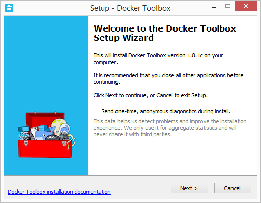
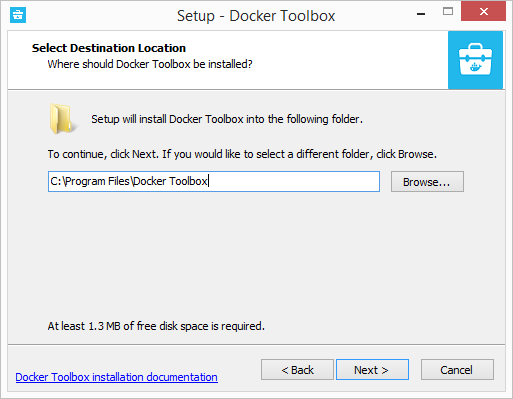
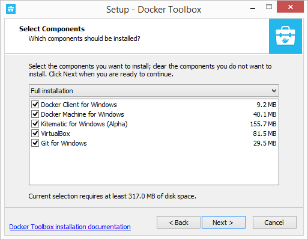
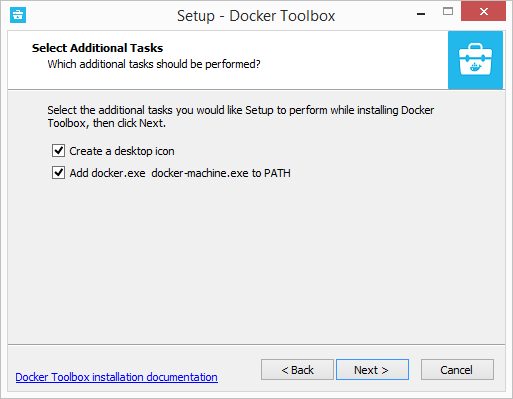
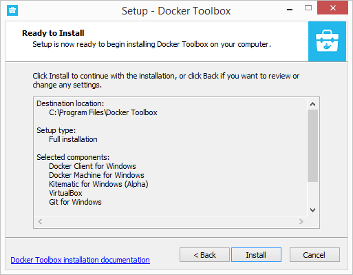
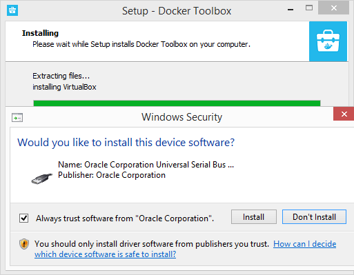
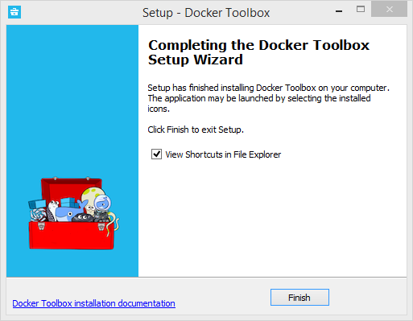

---
title: Docker on Windows
description: Provides instructions on how to install the Docker toolbox on Windows
topics:
  - docker
asset_path: /Users/cons6216/Documentation/docs-container-service/_assets/
---  
 

**Docker support for Windows** 

You can now use the Docker client directly from a Windows computer to manage containers that are running on Linux hosts.

In a Docker installation on Linux, your computer functions both as the localhost and the Docker host. In networking, localhost means your computer. The Docker host represents the computer on which the containers run.

On a typical Linux installation, the Docker client, the Docker daemon, and any containers run directly on your localhost. This means you can address ports on a Docker container using standard localhost addressing such as localhost:8000 or 0.0.0.0:8376.

In an Windows installation, the docker daemon is running inside a Linux virtual machine. You use the Windows Docker client to talk to the Docker host VM. Your Docker containers run inside this host.

In Windows, the Docker host address is the address of the Linux VM. When you start the VM with docker-machine it is assigned an IP address. When you start a container, the ports on a container map to ports on the VM. To see this in practice, work through the exercises on this page.

 
 **System Requirements** 
 
Your machine must be running on of the following Windows operating systems to run Docker:

* Windows 7.1
* 8/8.1

**Note** Windows 10 is not currently supported.

**Important** Make sure your Windows system supports Hardware Virtualization Technology and that virtualization is enabled. For Windows 7, run the Microsoft® Hardware-Assisted Virtualization Detection Tool and follow the on-screen instructions.
 
 **Installing Docker Toolbox** 	
 
To install the Docker toolbox, follow these instructions:
 
1. Go to the Docker Toolbox page.

2. Click the installer link to download.

3. Double-click the installer. This launches the Docker Toolbox setup wizard.

4. On the welcome page, click **Next**.

5. Select a folder in which you want Docker Toolbox to be installed, or else accept the default install location. Click **Next**.

6. On the **Select Components** page, select the components that you want to install, and then click **Next**.

7. On the **Select Additional Tasks** page, select the additional tasks you want the setup application to perform, and then click **Next**.

8. Click **Install** to confirm that you want to install this software.

9. When asked to confirm that you really want to install this software, click **Install**.

10. Click **Finish** to exit the setup wizard.

**Troubleshooting Docker on Windows**
